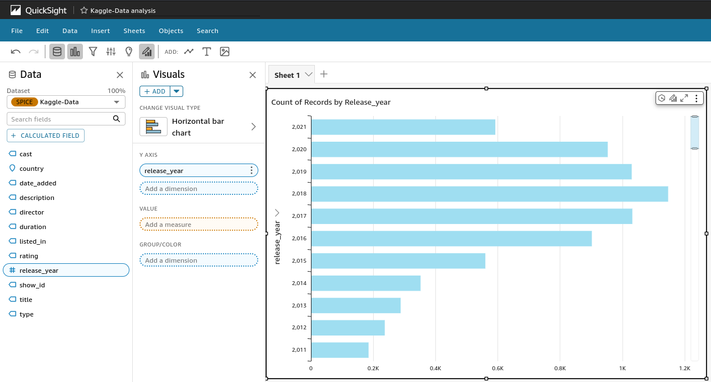
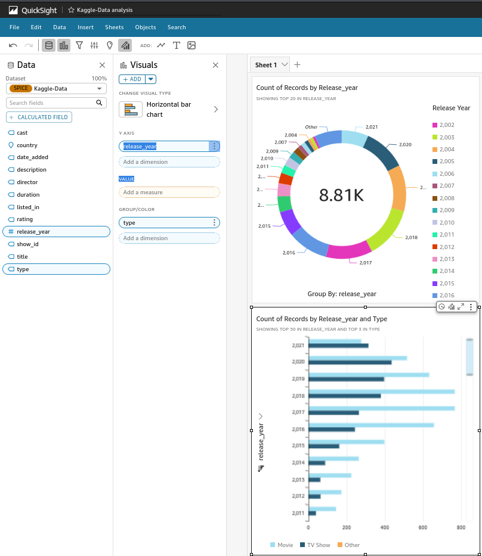
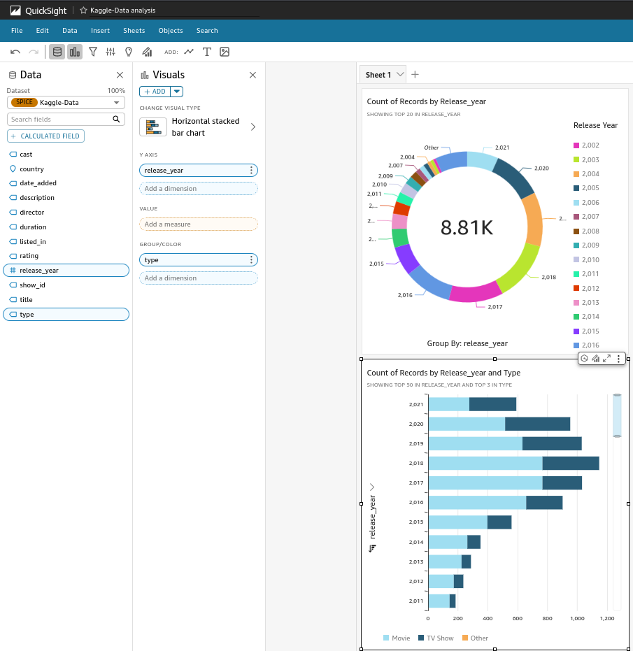

# Visualize data with Quicksight AWS


```json
{
   "fileLocations": [
       {
           "URIs": [
               "s3://extwork-quicksight-project-zidan/netflix_titles.csv"
           ]
       }
   ],
   "globalUploadSettings": {
       "format": "CSV",
       "delimiter": ",",
       "textqualifier": "\"",
       "containsHeader": "true"
   }
}
```











