# Visualize data with Quicksight AWS

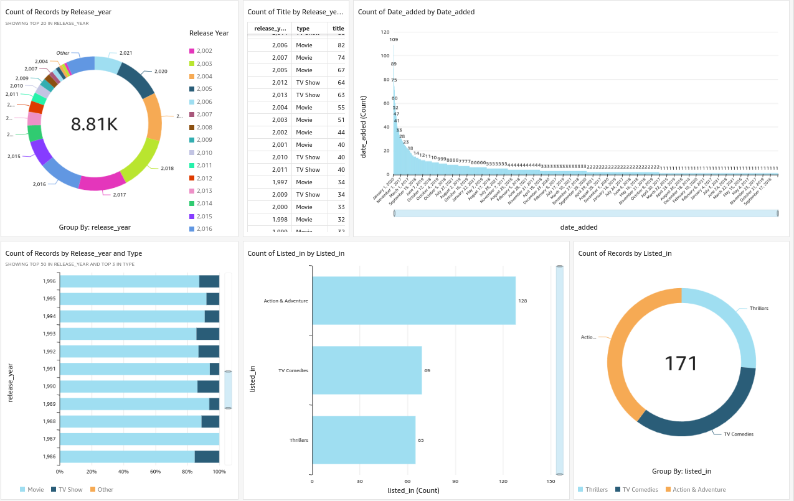

First I create a S3 bucket in AWS with `extwork-quicksight-project-zidan`

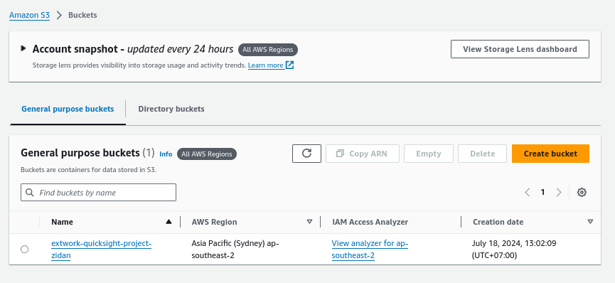

Then I upload the `netflix_titles.csv` file to the bucket.

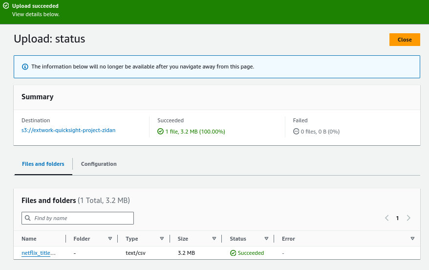

Next I copy the S3 URL of `netflix_titles.csv` and paste it inside the `manifest.json` file. The file should look like this:


```json
{
   "fileLocations": [
       {
           "URIs": [
               "s3://extwork-quicksight-project-zidan/netflix_titles.csv"
           ]
       }
   ],
   "globalUploadSettings": {
       "format": "CSV",
       "delimiter": ",",
       "textqualifier": "\"",
       "containsHeader": "true"
   }
}
```

After that, I upload the edited `manifest.json`

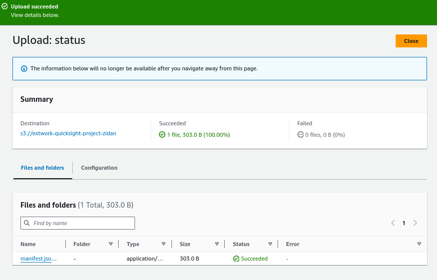


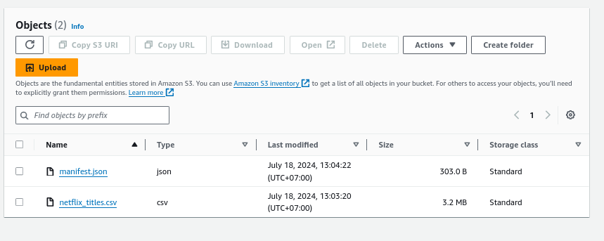

Aftert that, I create an Amazon QuickSight account. I use this configuration to make the QuickSight can work well with my S3 Bucket.

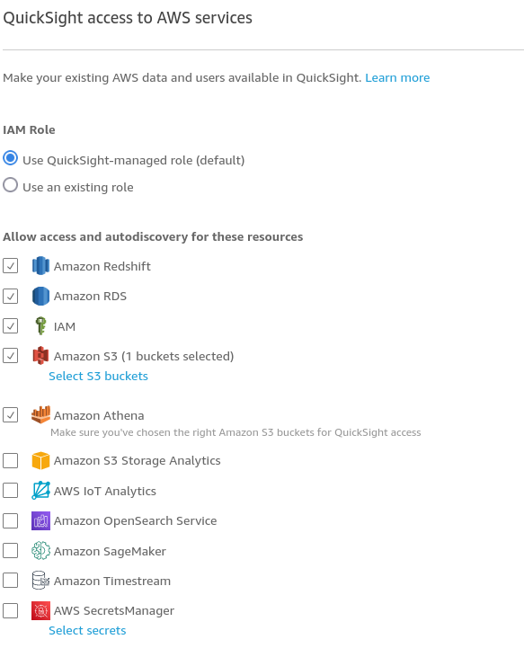

Make sure to specify the bucket that will be allowed to accessed by QuickSight. To do that, in `Amazon S3` click `Select S3 Buckets` then choose your bucket.

**IMPORTANT!!!!**

Please uncheck `Add Pixel-Perfect Reports` so you will not get charged.

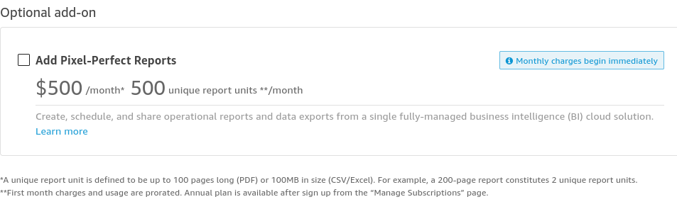

Wait some time, after this view show up, then your Quicksight account is created.

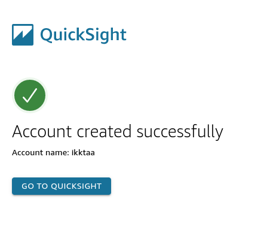

I connected the S3 bucket to QuickSight by adding new S3 datasets and then
enter the data source name and my manifest.json S3 URL.

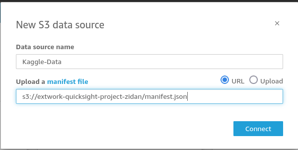

To create visualization on QuickSight, first I select `+ ADD` and then I choose
the graph and drag the data to the Visuals tab.

The chart/graph shown here is a breakdown of the shows in netflix. The top
one is showing how many titles releases each year, and the bottom one shows the percentage of how many titles in each type that are released each year.

I choose the first one as `Donut Graph` and the second as `Horizontal Stacked 100% Bar Stacked`.

I created this graph by dragging and dropping `release_year` to `Group/Color`
(for the top one) and `Y Axis` section (for the bottom one) and `type` to
`Group/Color` section (for the bottom one) in Visuals tab.

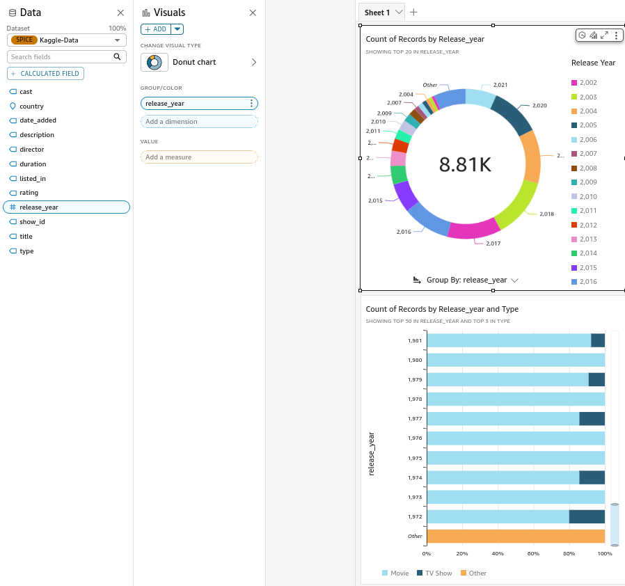


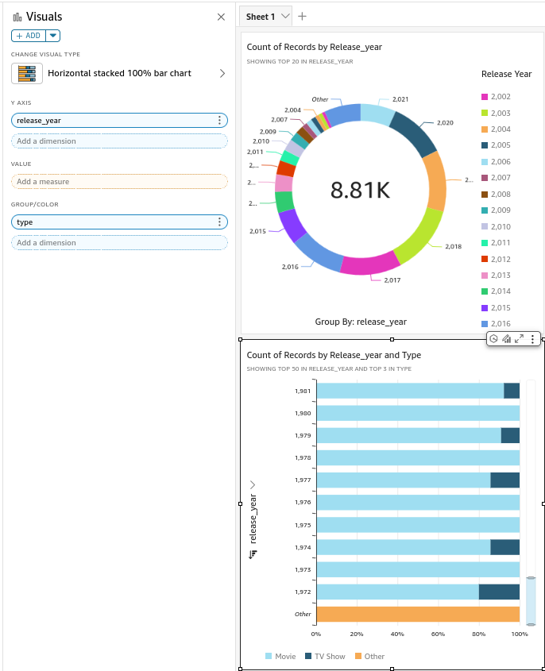

For the table I drag `release_year` and `type` to `Group By 2` and `title` to `Value`. Then I sorted it in descending order.

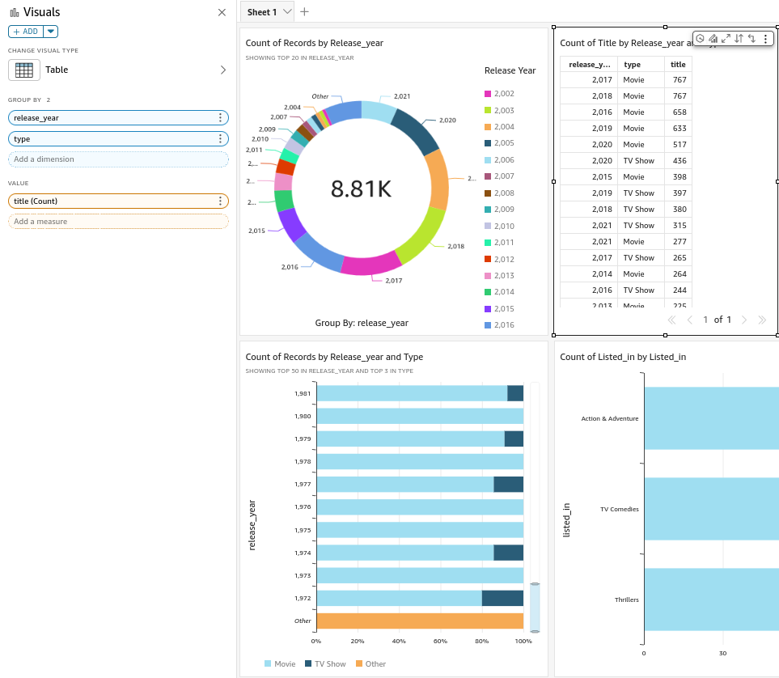

Next I want to create graph to filter titles in certain genre. In here I choose `Action & Adventure`, `TV Comedies` and `Thrillers`.

To do that, I add another visuals and choose `Horizontal bar chart` as the graph. Then I drag `listed_in` to `Y Axis` and `Value` section.

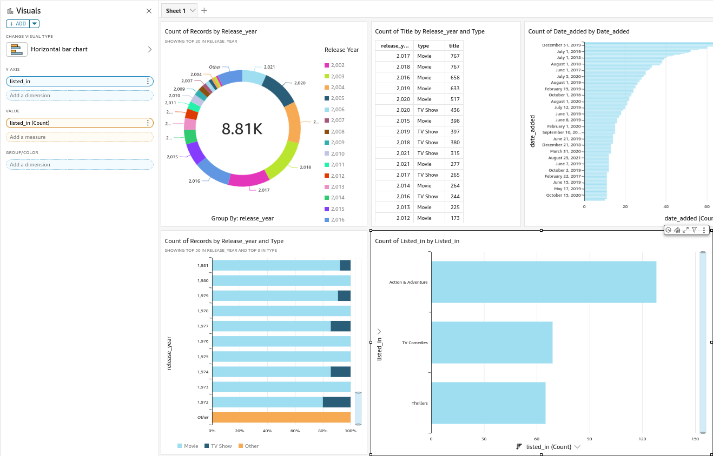

Next, I need to setup filter so it's only show from certain genre. First, go to `Data` tab and click the 3 three dots on the data that I want to filter. then click `Add filter for this field`.

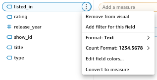

Then click the `listed_in` to edit the filter.

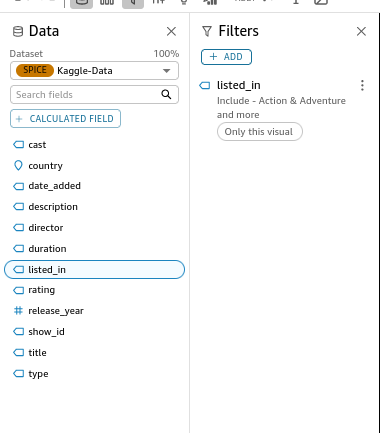

Next I choose the genre that I want to show. After that click `apply`.

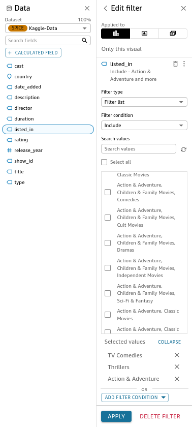

Now the graph only shows how many titles in each genre.


Next, I want to filter it again. This time I want to only show titles from 2015 until 2021.

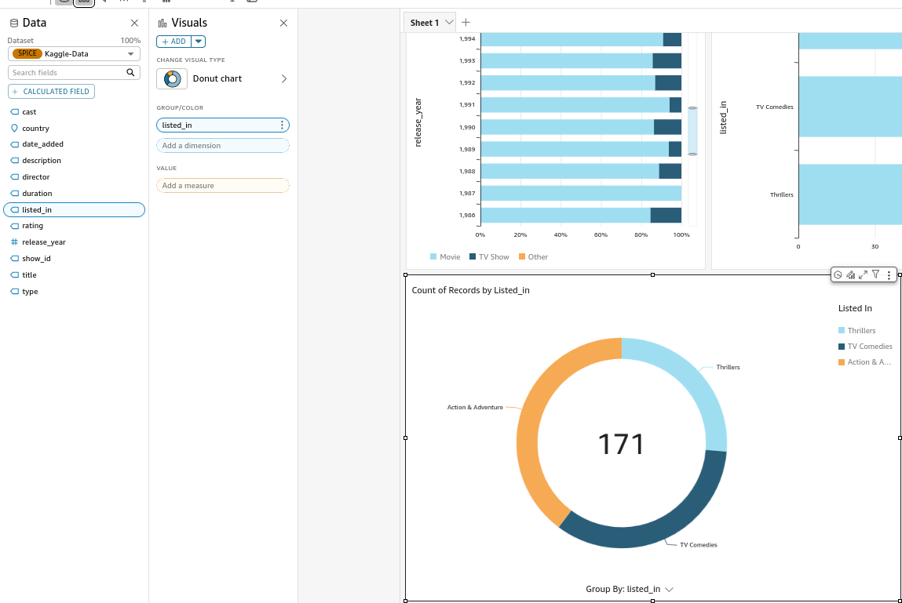

To do that. In the filter tab, I drag `release_year` to the filter and then click it.

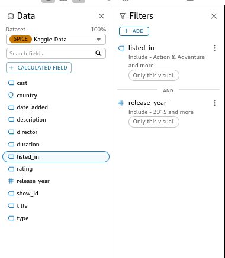

Next, I only check from 2015 until 2021. click `apply`.

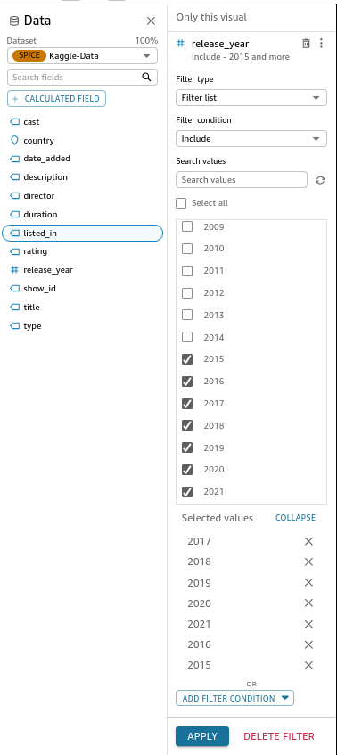

now the graph only show tiltles from 2015 to 2021 in the selected genre.


I also add another graph to show how many titles that are released each year. This is the end result of the graph after I tidying it up a bit.


I also export the graph in PDF by go to `File` then `Print` and then `Print as PDF`.

